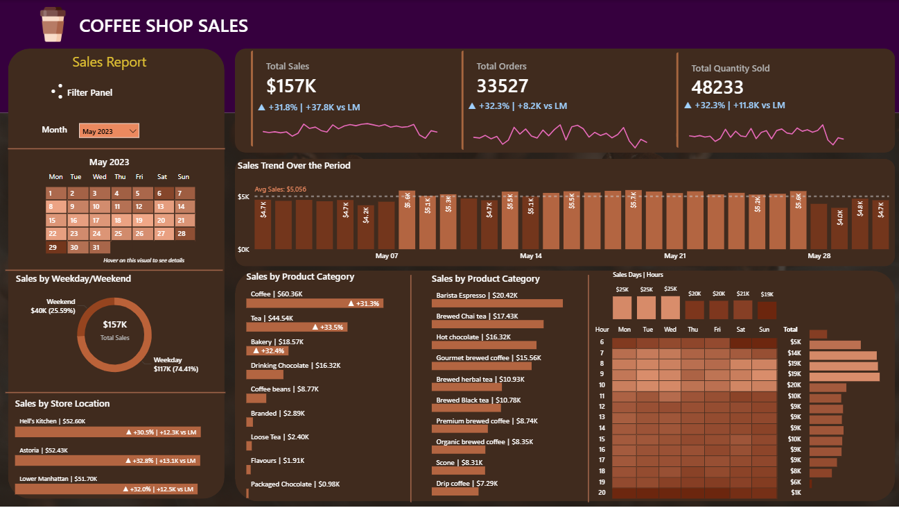

#  Coffee-Sales-Performance-Analysis

Analyzing coffee shop sales performance to uncover revenue trends, product demand patterns, and store-level insights using SQL and Power BI.

---

## 📌 Table of Contents
- <a href="#overview">Overview</a>
- <a href="#business-problem">Business Problem</a>
- <a href="#dataset">Dataset</a>
- <a href="#tools--technologies">Tools & Technologies</a>
- <a href="#project-structure">Project Structure</a>
- <a href="#data-cleaning--preparation">Data Cleaning & Preparation</a>
- <a href="#exploratory-data-analysis-eda">Exploratory Data Analysis (EDA)</a>
- <a href="#research-questions--key-findings">Research Questions & Key Findings</a>
- <a href="#dashboard">Dashboard</a>
- <a href="#how-to-run-this-project">How to Run This Project</a>
- <a href="#final-recommendations">Final Recommendations</a>
- <a href="#author--contact">Author & Contact</a>

---
<h2><a class="anchor" id="overview"></a> 📖 Overview</h2>
This project analyzes transactional coffee shop sales data to evaluate monthly revenue trends, order patterns, product performance, and store-level comparisons.  

An end-to-end analytics workflow was implemented using **MySQL for data transformation and KPI calculation**, and **Power BI for interactive dashboard visualization**.

---
<h2><a class="anchor" id="business-problem"></a> ❗Business Problem</h2>

Coffee shop businesses often struggle to:

- Track monthly sales performance  
- Identify top-performing products  
- Compare store-level performance  
- Understand customer demand by time and day  
- Detect revenue fluctuations  

This project transforms raw sales data into actionable insights to support better pricing, staffing, and inventory decisions.

---
<h2><a class="anchor" id="dataset"></a> 📂 Dataset</h2>

Coffee Shop Sales Dataset – <a href="https://github.com/chaitrabijjal/Coffee-Sales-Performance-Analysis/blob/e6ff252a4150732666491a64b49eff234a0b5c8c/Coffee%20Shop%20Sales.xlsx">Excel File</a>

---

<h2><a class="anchor" id="tools--technologies"></a> 🛠 Tools & Technologies</h2>

- **MySQL** – Data cleaning, transformation, KPI calculations  
- **Power BI** – Interactive dashboard
### SQL Functions Used:
`SUM()`, `COUNT()`, `AVG()`, `LAG()`, `STR_TO_DATE()`, `MONTH()`, `DAY()`, `DAYOFWEEK()`, `CASE`, `JOINS`, `SUBQUERIES`, `WINDOW FUNCTIONS`

---
<h2><a class="anchor" id="project-structure"></a> 📁 Project Structure</h2>

```
coffee-sales-performance-analysis/
│
├── README.md
├── dataset/
│   └── coffee_sales.csv
│
├── sql/
│   └── Coffee_Sales_Dashboard.sql
│
├── dashboard/
│   └── Coffee_Shop_Sales.pbix
```

---

<h2><a class="anchor" id="key-kpis"></a> 🧹 Data Cleaning & Preparation</h2>

- Converted date fields using STR_TO_DATE  
- Created month and weekday columns  
- Removed null or inconsistent entries  
- Aggregated sales at monthly and store levels  
- Calculated Month-over-Month (MoM) growth using LAG()
  
---

<h2><a class="anchor" id="data-cleaning--preparation"></a>📊 Key KPIs </h2>

- Total Sales  
- Total Orders  
- Total Quantity Sold  
-  Month-over-Month (MoM) Growth % 
- Sales by Store Location  
- Sales by Product Category  
- Top 10 Products by Revenue  
- Sales by Day & Hour  

---

<h2><a class="anchor" id="exploratory-data-analysis-eda"></a> 🔎 Exploratory Data Analysis (EDA)</h2>

Key patterns identified:

- Certain months showed strong revenue growth trends  
- Weekend sales patterns differed from weekdays  
- Top 10 products contributed major share of total revenue  
- Specific hours (morning & evening) had peak sales activity  
- Store-level comparison revealed performance gaps  

---
<h2><a class="anchor" id="dashboard"></a>Dashboard</h2>

- The Power BI dashboard includes:

✔ KPI Cards (Sales, Orders, Quantity)  
✔ MoM Growth Analysis  
✔ Calendar Heat Map  
✔ Daily Sales with Average Line  
✔ Store Performance Comparison  
✔ Product Category Analysis  
✔ Top 10 Products  
✔ Sales Heatmap by Day & Hour  



---
<h2><a class="anchor" id="how-to-run-this-project"></a> ▶ How to Run This Project</h2>

1. Clone or download the repository.  
2. Import the dataset into MySQL.  
3. Run SQL queries to calculate KPIs.  
4. Open `Coffee_Shop_Sales.pbix` in Power BI.  
5. Refresh the data connection.  
6. Explore dashboard using slicers and filters.  

---

## 💼 Business Impact

- Improved visibility into monthly and store-level performance  
- Enabled identification of high-revenue products  
- Supported staffing decisions using hourly demand analysis  
- Helped optimize inventory planning  
- Enabled data-driven business strategy
  
---

<h2><a class="anchor" id="final-recommendations"></a> 📌 Final Conclusion </h2>

This project successfully transformed raw transactional coffee sales data into actionable business intelligence insights. The interactive dashboard enables stakeholders to monitor revenue trends, evaluate product performance, and optimize operational decisions.

---

<h2><a class="anchor" id="author--contact"></a>Author & Contact</h2>

**Chaitra Bijjal**  
Data Analyst  

📧 Email: chaitrabijjal15@gmail.com

🔗 [LinkedIn](https://www.linkedin.com/in/chaitra-bijjal-16577a3a9)  
